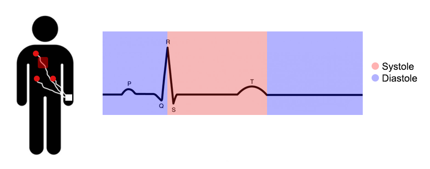

# JRA-2026

<i>This repository will house all relevant documents and scripts for my 2026 University of Sussex <b>Junior Research Associate</b> (JRA) Scheme project</i>

<b>Project Title: "Role of the Cardiac Cycle in the Perception of Reality and Illusion"</b>

## Aims and Hypotheses
- Aim: To investigate the role of the cardiac phase (systole vs diastole) in visual illusion sensitivity.
- Hypothesis: It is predicted that visual illusion sensitivity will be stronger (i.e., perception will be less accurate) during systole than diastole in the “Illusion Game” task.

<figure align="center">
 
 <figcaption><i>Physiological pathways for systole/diastole and the predicted responses towards illusion sensitivity.</i></figcaption>
</figure>

## Planned analysis

### Behavioural data
Raw data from the IG will be preprocessed and then cleaned in R, excluding trials with reaction times (RTs) < 125 ms or > 4 SD above the mean RT, as well as blocks with an error rate > 50% (Makowski et al., 2023)[^1]. Illusion sensitivity will be calculated per illusion type, operationalised as the mean error rate across the incongruent trials. Event-related data from the IG will be recorded using the PLUX Biosignals Photosensor, detecting a black marker on the screen at trial onset.

### Physiological data
The NeuroKit2 Python package (Makowski et al., 2021)[^2] will be used to apply a band pass filter to the ECG data, where the QRS complex within each cardiac cycle will be segmented to delineate the cardiac phase, based on physiological characteristics of the signal. Here, ventricular systole will be defined as occurring between each R peak to the end of the subsequent T wave, whereas ventricular diastole will comprise the remaining signal until the following R peak (Figure 3). The concurrent cardiac phase at each trial will be retrospectively calculated through the photosensor marker detection, recorded in unison with the ECG.

<figure align="center">
 
 <figcaption><i>ECG signal depicting one cardiac cycle.</i></figcaption>
</figure>

### Cognitive modelling
The data will be fitted to a drift diffusion model (DDM) – a cognitive model aiming to reproduce the noisy process of evidence accumulation taking place within the brain during 2AFC tasks (Ratcliff & McKoon, 2008)[^3]. A four-parameter DDM will analyse the speed and accuracy responses in the incongruent trials from the IG to understand the relationship between each cardiac phase and illusion sensitivity. RT distributions according to trial accuracy over the concurrency of systole/diastole will be plotted.

## References
[^1]: Makowski, D., Te, A. S., Kirk, S., Liang, N. Z., & Chen, S. H. A. (2023). A novel visual illusion paradigm provides evidence for a general factor of illusion sensitivity and personality correlates. Scientific Reports, 13(1), 6594. https://doi.org/10.1038/s41598-023-33148-5

[^2]: Makowski, D., Pham, T., Lau, Z. J., Brammer, J. C., Lespinasse, F., Pham, H., Schölzel, C., & Chen, S. H. A. (2021). NeuroKit2: A Python toolbox for neurophysiological signal processing. Behavior Research Methods, 53(4), 1689–1696. https://doi.org/10.3758/s13428-020-01516-y

[^3]: Ratcliff, R., & McKoon, G. (2008). The diffusion decision model: Theory and data for two-choice decision tasks. Neural Computation, 20(4), 873–922. https://doi.org/10.1162/neco.2008.12-06-420