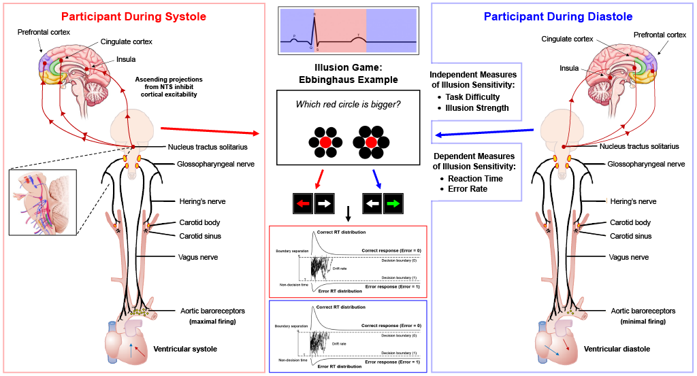

# JRA-2026

<i>This repository will house all relevant documents and scripts for my 2026 University of Sussex <b>Junior Research Associate</b> (JRA) scheme project</i>

<b>Project Title: "Role of the Cardiac Cycle in the Perception of Reality and Illusion"</b>

## Aims and Hypotheses
- Aim: To investigate the role of the cardiac phase (systole vs diastole) in visual illusion sensitivity.
- Hypothesis: It is predicted that visual illusion sensitivity will be stronger (i.e., perception will be less accurate) during systole than diastole in the “Illusion Game” task.

<figure>
 
 <figcaption><i>Physiological pathways for systole/diastole and the predicted responses towards illusion sensitivity.</i></figcaption>
</figure>